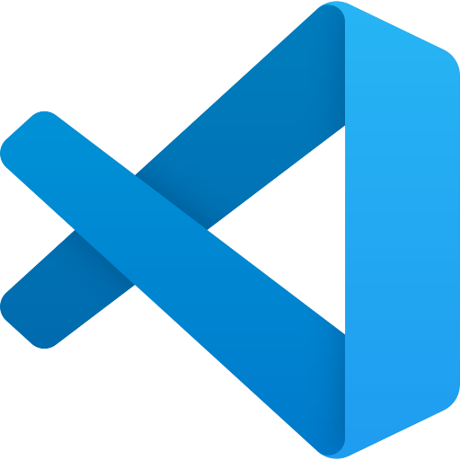

# Copilot Codesapces Demo

This repository includes a Copilot training exercise intended to give you practical experience using Copilot and Codespaces.

## 🎯 Goal

- Create a codespace that based on `.devcontainer/devcontainer.json` configuration file.
- Prompt GitHub Copilot and Copilot Chat to walk through the software development exercises.

## ✍️ Programming Languages

- Python

## 💻 IDE

-  VS Code in a codespace

## 🗒️ Guide

### Our Mission

Our goal is to provide a self-serve, one-click Copilot experience that will be hosted on Codespaces.

### What to Expect

During the the GitHub Copilot+Codespaces Playground Demo, you are in charge! You will have the opportunity to learn more about Copilot, it's features and how it can help you achieve your development Goals!

_If you are in need of assistance, we have provided Codetours located in the left hand corner that help guide you through the current Copilot capabilities!_

[Follow the full GitHub Copilot and Codespaces guide](./copilot_and_codespaces.md)

## 🤝 Contributing

Contributions are warmly welcomed! ✨

To contribute to a public exercise, please refer to our contribution guidelines [here](https://github.com/ps-copilot-sandbox/.github/blob/main/.github/CONTRIBUTING.md).

To create a net new exercise, please use [this repository template](https://github.com/ps-copilot-sandbox/copilot-exercise-template).
